# 智能家居后端

[](https://docs.python.org/3.11/)
[](https://fastapi.tiangolo.com/)
[](https://github.com/nicholaschris/aiosqlite)
[](LICENSE)

基于 FastAPI + SQLite + APScheduler 的智能家居管理后端，支持摄像头管理、录制调度、NAS 同步、设备扫描、DLNA 投屏、家庭成员在线检测和用户账户认证。

---

## 架构图

```mermaid
graph TB
    subgraph Client
        WEB[Web App<br/>:5173] --> API[API Server<br/>:8000]
        WS[WebSocket<br/>Client] --> API
    end

    subgraph API_Layer["接口层 (API)"]
        AUTH["/auth/*"]
        DEV["/devices/*"]
        CAM["/cameras/*"]
        REC["/recordings/*"]
        SCH["/schedules/*"]
        MEM["/members/*"]
        DLNA["/dlna/*"]
        ANLYT["/analytics/*"]
        HEALTH["/health"]
    end

    subgraph Service_Layer["服务层 (Services)"]
        SCAN[scanner.py<br/>设备扫描]
        ONVIF[onvif_client.py<br/>摄像头控制]
        RECSVC[recorder.py<br/>录制管理]
        SCH_SVC[scheduler_service.py<br/>定时调度]
        NAS[nas_syncer.py<br/>存储同步]
        PRES[presence_service.py<br/>在线检测]
        DLNA_SVC[dlna_service.py<br/>DLNA 投屏]
        WS_MGR[ws_manager.py<br/>WebSocket 管理]
        EMAIL[email.py<br/>邮件服务]
    end

    subgraph Domain_Layer["领域层 (Domain)"]
        REC_D[recording_domain.py<br/>录制状态机]
        PRES_D[presence_domain.py<br/>成员在场逻辑]
        CAM_H[camera_health.py<br/>摄像头健康检查]
    end

    subgraph Data_Layer["数据层 (Models + DB)"]
        DEV_M[device.py]
        CAM_M[camera.py]
        REC_M[recording.py]
        SCH_M[schedule.py]
        MEM_M[member.py]
        DLNA_M[dlna_device.py]
        USR_M[user.py]
        DB[(SQLite<br/>smart_home.db)]
    end

    API --> AUTH
    API --> DEV
    API --> CAM
    API --> REC
    API --> SCH
    API --> MEM
    API --> DLNA
    API --> ANLYT
    API --> HEALTH

    DEV --> SCAN
    CAM --> ONVIF
    CAM --> RECSVC
    CAM --> REC_D
    REC --> SCH_SVC
    REC --> NAS
    MEM --> PRES
    MEM --> PRES_D
    DLNA --> DLNA_SVC
    SCH --> SCH_SVC
    AUTH --> EMAIL

    SCAN --> DEV_M
    ONVIF --> CAM_M
    RECSVC --> REC_M
    SCH_SVC --> SCH_M
    PRES --> MEM_M
    DLNA_SVC --> DLNA_M
    AUTH --> USR_M

    DEV_M --> DB
    CAM_M --> DB
    REC_M --> DB
    SCH_M --> DB
    MEM_M --> DB
    DLNA_M --> DB
    USR_M --> DB

    WS_MGR --> WS
    SCH_SVC --> WS_MGR
    PRES --> WS_MGR
    SCAN --> WS_MGR

    subgraph External_Tools["外部依赖"]
        FFMPG[ffmpeg]
        SCAPY[Scapy + nmap]
        SMB[SMB Protocol]
        RESEND[Resend API]
    end

    RECSVC --> FFMPG
    SCAN --> SCAPY
    NAS --> SMB
    EMAIL --> RESEND
```



---

## 功能概览

| 模块 | 说明 |
|------|------|
| **用户认证** | 邮箱注册/验证、JWT Bearer Token 登录、密码找回与重置、管理员账户自动引导 |
| **设备管理** | 局域网设备扫描（Scapy + nmap），在线状态跟踪，分页查询，支持 14 种设备类型自动识别 |
| **摄像头管理** | ONVIF 发现与配置，实时流地址（RTSP/HTTP），MJPEG 代理，HLS 实时流，摄像头健康检查 |
| **录制调度** | ffmpeg 分段录制，APScheduler 定时任务，录制预设（preset），调度覆盖参数，自动录制触发（成员到家/离家） |
| **NAS 同步** | 本地存储 / Docker 挂载 / SMB 三种模式，录制完成后自动同步，支持 SMB 协议推送 |
| **DLNA 投屏** | SSDP 发现局域网 MediaRenderer，媒体文件上传，推送播放，控制播放/暂停/停止 |
| **成员在线检测** | 绑定成员与设备 MAC，轮询检测在线状态，Webhook 通知，记录出入日志，到家/离家统计 |
| **WebSocket** | 实时事件推送（扫描结果、录制状态、DLNA 发现、成员在线变化、摄像头健康） |
| **数据分析** | 设备在线统计、录制日历、热力图、设备稳定性、新设备发现等 |

---

## 技术栈

| 分类 | 技术 |
|------|------|
| **框架** | FastAPI 0.136 + Uvicorn |
| **数据库** | SQLite (aiosqlite + SQLAlchemy 异步) |
| **定时任务** | APScheduler 3.10 |
| **设备扫描** | Scapy 2.7 + python-nmap |
| **摄像头** | ONVIF (onvif-zeep-async) |
| **录制** | ffmpeg (subprocess 调用) |
| **认证** | python-jose (JWT HS256) + bcrypt |
| **邮件** | Resend API (httpx) |
| **网络** | httpx (异步 HTTP 客户端) |
| **日志** | loguru |
| **配置** | pydantic-settings |
| **代码质量** | pytest, ruff, mypy |

---

## 环境要求

- Python 3.11+
- [uv](https://docs.astral.sh/uv/) 包管理器
- ffmpeg（录制功能必需，需加入 PATH）
- libpcap（Windows 需安装 WinPcap/Npcap，扫描功能必需）

---

## 快速启动

### 1. 安装依赖

```bash
uv sync
```

### 2. 配置环境变量

```bash
cp .env.example .env
```

编辑 `.env`，至少修改以下字段：

**必填：**

| 变量 | 默认值 | 说明 |
|------|--------|------|
| `JWT_SECRET_KEY` | — | 随机字符串，至少 32 位，不能使用默认占位符 |
| `ADMIN_USERNAME` | `admin` | 管理员用户名 |
| `ADMIN_PASSWORD` | — | 管理员密码，至少 8 位，不能为 `change_me` |
| `CAMERA_ONVIF_PASSWORD` | — | 摄像头 ONVIF 密码 |
| `NETWORK_RANGE` | `auto` | 要扫描的网段，如 `192.168.1.0/24`；`auto` 自动推断 |

**录制（可选）：**

| 变量 | 默认值 | 说明 |
|------|--------|------|
| `RECORDING_TEMP_DIR` | `/tmp/recordings` | ffmpeg 临时输出目录 |
| `RECORDING_SEGMENT_SECONDS` | `1800` | 单段录制时长（秒），默认 30 分钟 |
| `RECORDING_RETENTION_DAYS` | `30` | 录制文件保留天数 |

**NAS 存储（可选）：**

| 变量 | 默认值 | 说明 |
|------|--------|------|
| `NAS_MODE` | `local` | `local`（本地）/ `mount`（Docker 挂载）/ `smb`（网络推送） |
| `LOCAL_STORAGE_PATH` | `./data/recordings` | local 模式：本地保存路径 |
| `NAS_MOUNT_PATH` | `/nas/cameras` | mount 模式：容器内挂载路径 |
| `NAS_SMB_HOST` | — | smb 模式：NAS IP |
| `NAS_SMB_SHARE` | — | smb 模式：共享文件夹名 |
| `NAS_SMB_USER` | — | smb 用户名 |
| `NAS_SMB_PASSWORD` | — | smb 密码 |

**邮件服务（可选）：**

| 变量 | 默认值 | 说明 |
|------|--------|------|
| `RESEND_API_KEY` | — | Resend 邮件服务 API Key；不配置时注册用户直接激活（开发模式） |
| `RESEND_FROM_EMAIL` | `onboarding@resend.dev` | 发件人邮箱地址 |
| `APP_BASE_URL` | `http://localhost:8000` | 应用基础 URL，用于邮件中的链接 |

**其他（可选）：**

| 变量 | 默认值 | 说明 |
|------|--------|------|
| `CORS_ALLOW_ORIGINS` | `http://localhost:5173` | 允许的跨域来源，多个用逗号分隔 |
| `SCAN_INTERVAL_SECONDS` | `60` | 设备自动扫描间隔（秒） |
| `PRESENCE_POLL_INTERVAL_SECONDS` | `30` | 成员在线检测轮询间隔（秒） |
| `CAMERA_HEALTH_INTERVAL_SECONDS` | `60` | 摄像头健康检查间隔（秒） |
| `LOG_LEVEL` | `INFO` | 日志级别 |

### 3. 启动服务

**生产模式：**
```bash
uv run uvicorn app.main:app --host 0.0.0.0 --port 8000
```

**开发模式（热重载）：**
```bash
uv run uvicorn app.main:app --host 0.0.0.0 --port 8000 --reload
```

**使用 dev 脚本：**
```bash
uv run dev
```

服务启动后访问：
- API 文档：http://localhost:8000/api/docs
- 健康检查：http://localhost:8000/api/v1/health
- 登录接口：`POST /api/v1/auth/login`

### 4. 获取 JWT Token

```bash
curl -X POST http://localhost:8000/api/v1/auth/login \
  -H "Content-Type: application/json" \
  -d '{"email":"admin","password":"your_password"}'
```

后续请求在 Header 中携带：`Authorization: Bearer <token>`

### 5. WebSocket 连接

```
ws://localhost:8000/ws?token=<jwt_token>
```

服务端主动推送的事件类型：

| 事件 | 说明 |
|------|------|
| `scan_completed` | 设备扫描完成 |
| `unknown_device_detected` | 发现未知设备 |
| `recording_completed` | 录制完成 |
| `recording_failed` | 录制失败 |
| `dlna_discover_started` | DLNA 设备发现开始 |
| `dlna_discover_completed` | DLNA 设备发现完成 |
| `dlna_cast_started` | DLNA 投屏开始 |
| `member_arrived` | 成员到家 |
| `member_left` | 成员离家 |
| `camera_online` | 摄像头恢复在线 |
| `camera_offline` | 摄像头离线 |

---

## 项目结构

```
smart_home/backend/
├── app/
│   ├── main.py              # FastAPI 应用入口 & lifespan 管理
│   ├── config.py            # 环境变量配置（pydantic-settings）
│   ├── database.py          # SQLAlchemy 异步引擎 & 初始化（懒加载）
│   ├── auth.py              # JWT 签发与校验（HS256）
│   ├── deps.py              # FastAPI 依赖注入（get_db, get_current_user）
│   ├── desktop.py           # 桌面端打包入口（系统托盘）
│   │
│   ├── api/                 # API 路由层
│   │   ├── auth.py          # 认证（注册/登录/验证邮箱/密码找回）
│   │   ├── system.py        # 健康检查 & 仪表盘
│   │   ├── devices.py       # 设备管理 & 扫描
│   │   ├── cameras.py       # 摄像头管理、MJPEG/HLS 流、预设管理
│   │   ├── recordings.py    # 录制记录、流媒体播放、下载
│   │   ├── schedules.py     # 录制调度（cron）
│   │   ├── members.py       # 家庭成员、设备绑定、在线日志
│   │   ├── dlna.py          # DLNA 发现 & 投屏
│   │   ├── analytics.py     # 数据分析与统计
│   │   ├── user.py          # 用户设置（语言偏好）
│   │   └── ws.py            # WebSocket 路由
│   │
│   ├── services/            # 基础服务层
│   │   ├── email.py         # 邮件服务（Resend API）
│   │   └── ws_manager.py    # WebSocket 连接管理（主实现）
│   │
│   ├── domain/
│   │   ├── services/        # 领域服务（核心业务逻辑）
│   │   │   ├── scanner.py           # 设备扫描（Scapy/nmap）& 设备类型识别
│   │   │   ├── recorder.py          # ffmpeg 录制任务管理
│   │   │   ├── onvif_client.py      # ONVIF 摄像头控制
│   │   │   ├── nas_syncer.py        # NAS/本地存储同步
│   │   │   ├── scheduler_service.py # APScheduler 封装
│   │   │   ├── presence_service.py  # 成员在线检测（MAC 轮询）
│   │   │   ├── presence_domain.py   # 成员在场领域逻辑
│   │   │   ├── dlna_service.py      # DLNA/SSDP 控制
│   │   │   ├── recording_domain.py  # 录制状态机
│   │   │   ├── camera_health.py     # 摄像头健康检查（RTSP 探测）
│   │   │   └── ws_manager.py        # WebSocket 管理（向后兼容 re-export）
│   │   └── models/          # 领域模型（dataclass）
│   │
│   ├── models/              # SQLAlchemy ORM 模型
│   │   ├── device.py        # 网络设备（MAC/IP/在线状态/设备类型）
│   │   ├── camera.py        # 摄像头（ONVIF 配置/流地址/预设）
│   │   ├── recording.py     # 录制记录（文件路径/时长）
│   │   ├── schedule.py      # 录制调度（cron 表达式/预设/覆盖参数）
│   │   ├── member.py        # 家庭成员（姓名/MAC/在线状态/Webhook）
│   │   ├── device_online_log.py  # 设备小时级在线日志
│   │   ├── dlna_device.py   # DLNA 设备（UDN/类型/能力）
│   │   ├── user_settings.py # 用户设置（语言等）
│   │   ├── user.py          # 用户账户（邮箱/密码哈希/激活状态）
│   │   └── email_token.py   # 邮箱验证与密码重置 Token
│   │
│   └── schemas/             # Pydantic 请求/响应 Schema
│       ├── device.py
│       ├── camera.py
│       ├── recording.py
│       ├── schedule.py
│       ├── member.py
│       ├── dlna.py
│       ├── user.py
│       ├── auth.py          # 认证相关 Schema
│       └── __init__.py
│
├── tests/                   # 测试套件（193 个测试函数）
│   ├── conftest.py          # 全局 fixture（数据库/环境变量）
│   ├── unit/                # 单元测试（50 个测试）
│   │   ├── domain/
│   │   │   ├── test_auto_cast.py          # 自动 DLNA 投屏
│   │   │   ├── test_presence.py           # 成员在场触发录制
│   │   │   ├── test_unknown_devices.py    # 未知设备检测
│   │   │   ├── test_recorder.py           # 录制参数与 ffmpeg 命令构建
│   │   │   ├── test_scanner.py            # 网段检测与设备类型识别
│   │   │   └── test_recording.py          # 录制领域服务状态机
│   │   ├── services/
│   │   │   ├── test_camera_health_service.py  # 摄像头健康检查
│   │   │   └── test_email.py                  # 邮件服务
│   │   ├── models/
│   │   │   ├── test_auth_schemas.py       # 认证 Pydantic Schema 校验
│   │   │   └── test_user.py               # User ORM 模型
│   │   └── utils/
│   │       ├── test_auth_backward_compat.py   # 超级用户向后兼容
│   │       └── test_auth_email_tokens.py      # 邮箱/密码重置 Token
│   ├── integration/         # 集成测试（143 个测试）
│   │   ├── api/
│   │   │   ├── test_analytics.py    # 数据分析端点
│   │   │   ├── test_auth.py         # 认证端点基础
│   │   │   ├── test_auth_extended.py # 认证端点扩展（邮箱验证/密码重置）
│   │   │   ├── test_devices.py      # 设备端点
│   │   │   ├── test_members.py      # 成员端点（完整 CRUD）
│   │   │   ├── test_dlna.py         # DLNA 端点
│   │   │   └── test_recordings.py   # 录制端点（含流媒体/下载）
│   │   └── test_recording_presets.py # 录制预设（模型 + API）
│   └── e2e/                 # 端到端测试（规划中）
│
├── data/                    # 数据目录（运行时创建）
│   ├── smart_home.db        # SQLite 数据库
│   ├── app.log              # 日志文件（10 MB 轮转，保留 7 天）
│   ├── recordings/          # 录制文件存储（local 模式）
│   │   └── tmp/             # ffmpeg 录制临时目录
│   ├── hls/                 # HLS 流媒体分片
│   └── dlna_media/          # DLNA 上传媒体文件
│
├── docs/                    # 文档
│   └── superpowers/         # 设计文档和实现计划
│
├── tools/                   # 外部工具（打包用）
│   ├── ffmpeg/              # ffmpeg.exe
│   └── nmap/                # nmap.exe
│
├── .env.example             # 环境变量示例
├── pyproject.toml           # 项目配置（依赖/工具/包结构）
├── Dockerfile               # Docker 镜像构建
└── smart-home.spec          # PyInstaller 打包配置
```

---

## API 概览

所有接口挂载在 `/api/v1` 前缀下，认证接口除外。除 `/health`、`/auth/*` 和 WebSocket 外，其余接口均需携带 JWT Bearer Token。

### 认证

| 方法 | 路径 | 说明 |
|------|------|------|
| POST | `/api/v1/auth/register` | 注册账号（配置 Resend Key 时发送验证邮件） |
| GET | `/api/v1/auth/verify-email` | 激活邮箱（`?token=`） |
| POST | `/api/v1/auth/login` | 登录获取 JWT Token（支持 `remember_me` 延长至 30 天） |
| POST | `/api/v1/auth/forgot-password` | 发送密码重置链接 |
| POST | `/api/v1/auth/reset-password` | 使用 Token 设置新密码 |

### 系统

| 方法 | 路径 | 说明 |
|------|------|------|
| GET | `/api/v1/health` | 健康检查（数据库/ffmpeg/NAS 可写性/版本/运行时长；降级时返回 503） |
| GET | `/api/v1/dashboard` | 仪表盘摘要（成员/摄像头/设备/录制今日统计） |

### 设备

| 方法 | 路径 | 说明 |
|------|------|------|
| GET | `/api/v1/devices` | 分页查询设备列表（支持 device_type/online/search 过滤） |
| POST | `/api/v1/devices/scan` | 触发后台网络扫描（结果通过 WebSocket 推送） |
| GET | `/api/v1/devices/types` | 获取所有设备类型列表 |
| GET | `/api/v1/devices/topology` | 设备拓扑（含成员归属关系） |
| GET | `/api/v1/devices/heatmap` | 星期 × 小时在线热力图（range: 7d/30d/90d） |
| GET | `/api/v1/devices/{mac}` | 查询单个设备 |
| PATCH | `/api/v1/devices/{mac}` | 更新设备信息（别名等） |
| DELETE | `/api/v1/devices/{mac}` | 删除设备记录 |

### 摄像头

| 方法 | 路径 | 说明 |
|------|------|------|
| GET | `/api/v1/cameras` | 查询摄像头列表 |
| POST | `/api/v1/cameras` | 添加摄像头 |
| GET | `/api/v1/cameras/{mac}` | 查询单个摄像头 |
| PUT | `/api/v1/cameras/{mac}` | 更新摄像头配置 |
| DELETE | `/api/v1/cameras/{mac}` | 删除摄像头 |
| POST | `/api/v1/cameras/{mac}/probe` | ONVIF 发现（获取设备信息/profiles/RTSP 地址） |
| POST | `/api/v1/cameras/{mac}/record/start` | 开始 ffmpeg 录制（支持 preset/overrides） |
| POST | `/api/v1/cameras/{mac}/record/stop` | 停止录制并同步 NAS |
| GET | `/api/v1/cameras/{mac}/stream/mjpeg` | MJPEG 实时代理流 |
| GET | `/api/v1/cameras/{mac}/snapshot` | 获取单帧 JPEG 快照 |
| POST | `/api/v1/cameras/{mac}/live/start` | 启动 HLS 实时流（等待 m3u8 就绪最多 30 秒） |
| DELETE | `/api/v1/cameras/{mac}/live/stop` | 停止 HLS 流并删除分片 |
| GET | `/api/v1/cameras/{mac}/presets` | 查询录制预设列表 |
| POST | `/api/v1/cameras/{mac}/presets` | 创建录制预设 |
| PUT | `/api/v1/cameras/{mac}/presets/{preset_id}` | 更新录制预设 |
| DELETE | `/api/v1/cameras/{mac}/presets/{preset_id}` | 删除录制预设 |
| POST | `/api/v1/cameras/{mac}/presets/default` | 设置默认预设 |

### 录制

| 方法 | 路径 | 说明 |
|------|------|------|
| GET | `/api/v1/recordings` | 分页查询录制记录（支持 camera_mac/date 过滤，附带存储类型信息） |
| GET | `/api/v1/recordings/stats` | 录制统计（总数/总时长/总大小，range: Nd） |
| GET | `/api/v1/recordings/{id}` | 查询单条录制记录 |
| GET | `/api/v1/recordings/{id}/stream` | 视频流媒体播放（支持 Range 请求 / HTTP 206） |
| GET | `/api/v1/recordings/{id}/download` | 下载录制文件（Content-Disposition: attachment） |
| DELETE | `/api/v1/recordings/{id}` | 删除录制记录及文件 |
| POST | `/api/v1/recordings/{id}/open-folder` | 在 Windows 资源管理器中定位文件（仅 Windows） |

### 调度

| 方法 | 路径 | 说明 |
|------|------|------|
| GET | `/api/v1/schedules` | 查询录制调度列表 |
| POST | `/api/v1/schedules` | 创建调度（5 字段 cron 表达式，注册 APScheduler 任务） |
| GET | `/api/v1/schedules/{id}` | 查询单条调度 |
| PATCH | `/api/v1/schedules/{id}` | 更新调度（重新注册或移除 APScheduler 任务） |
| DELETE | `/api/v1/schedules/{id}` | 删除调度及 APScheduler 任务 |

### 成员

| 方法 | 路径 | 说明 |
|------|------|------|
| GET | `/api/v1/members` | 查询家庭成员列表 |
| POST | `/api/v1/members` | 添加成员 |
| GET | `/api/v1/members/{id}` | 查询单个成员 |
| PATCH | `/api/v1/members/{id}` | 更新成员信息 |
| DELETE | `/api/v1/members/{id}` | 删除成员 |
| GET | `/api/v1/members/{id}/devices` | 查询成员绑定的设备（含设备详情） |
| POST | `/api/v1/members/{id}/devices` | 绑定 MAC 地址到成员 |
| DELETE | `/api/v1/members/{id}/devices/{mac}` | 解绑设备 |
| GET | `/api/v1/members/{id}/logs` | 出入日志（分页） |
| GET | `/api/v1/members/{id}/stats` | 在家时长统计（range: 7d/30d） |

### DLNA

| 方法 | 路径 | 说明 |
|------|------|------|
| POST | `/api/v1/dlna/discover` | 触发 SSDP 扫描（结果通过 WebSocket 推送） |
| GET | `/api/v1/dlna` | 查询已发现的 DLNA 设备列表 |
| POST | `/api/v1/dlna/cast` | 推送外部 URL 到渲染器播放 |
| POST | `/api/v1/dlna/cast/file` | 上传文件（最大 500 MB）并推送到渲染器（1 小时后自动清理） |
| POST | `/api/v1/dlna/{device_id}/play` | 播放 |
| POST | `/api/v1/dlna/{device_id}/pause` | 暂停 |
| POST | `/api/v1/dlna/{device_id}/stop` | 停止 |
| GET | `/api/v1/dlna/{device_id}/status` | 获取 AVTransport 播放状态 |

### 数据分析

| 方法 | 路径 | 说明 |
|------|------|------|
| GET | `/api/v1/analytics/device-type-stats` | 各类型设备数量统计 |
| GET | `/api/v1/analytics/response-time` | 各设备平均响应时间（ms） |
| GET | `/api/v1/analytics/recording-calendar` | 每日录制数量日历 |
| GET | `/api/v1/analytics/new-devices` | 按 ISO 周统计新设备发现数量 |
| GET | `/api/v1/analytics/online-trend` | 每日平均在线设备数（range: 7d/30d/90d） |
| GET | `/api/v1/analytics/device-stability` | 各设备在线率（%，range 参数） |
| GET | `/api/v1/analytics/type-activity` | 设备类型 × 小时在线比例（range 参数） |

### 用户

| 方法 | 路径 | 说明 |
|------|------|------|
| GET | `/api/v1/user/profile` | 获取用户设置（语言等，不存在时自动创建 zh-CN 默认） |
| PUT | `/api/v1/user/profile` | 更新用户设置 |

### WebSocket

| 路径 | 说明 |
|------|------|
| `/ws?token=<JWT>` | 认证 WebSocket 连接；仅服务端推送，客户端消息会被丢弃 |

---

## 开发者指南

### 测试驱动开发（TDD）

本项目强制要求 TDD 流程，所有代码变更遵循以下顺序：

1. **先写测试** — 在修改或新增业务代码之前，先在 `tests/` 中编写覆盖目标场景的测试用例
2. **确认测试失败** — 运行新测试，确保测试因缺少功能/Bug 未修复而失败（红色阶段）
3. **实现代码** — 编写最小量的代码使测试通过（绿色阶段）
4. **重构** — 在测试保护下优化代码结构
5. **全量回归** — 运行 `uv run pytest tests/ -v` 确保全部测试通过

测试文件约定：
- `tests/conftest.py`：全局 fixture，包含数据库建表、环境变量等
- `tests/unit/`：纯单元测试，按 domain / services / models / utils 模块划分
- `tests/integration/`：API 端点集成测试，使用 ASGITransport 内存数据库
- `tests/e2e/`：端到端测试（规划中）

### 测试命令

```bash
# 运行所有测试
uv run pytest tests/ -v

# 只运行单元测试
uv run pytest tests/unit/ -v

# 只运行集成测试
uv run pytest tests/integration/ -v

# 运行指定测试文件
uv run pytest tests/integration/api/test_recordings.py -v

# 运行带覆盖率
uv run pytest tests/ -v --cov=app

# 只收集测试，不执行
uv run pytest tests/ --collect-only
```

### 代码规范

```bash
# 检查代码规范
uv run ruff check app/

# 自动修复
uv run ruff check app/ --fix

# 类型检查
uv run mypy app/
```

### 预提交检查

```bash
# 安装 pre-commit hooks
uv run pre-commit install

# 手动触发
uv run pre-commit run --all-files
```

---

## Docker 部署

```bash
# 构建镜像
docker build -t smart-home-backend .

# 运行容器
docker run -d \
  --name smart-home-backend \
  -p 8000:8000 \
  -v $(pwd)/.env:/app/.env \
  -v $(pwd)/data:/app/data \
  smart-home-backend
```

---

## 注意事项

- **ffmpeg**：录制功能依赖 ffmpeg，需单独安装并加入 PATH。健康检查接口会显示 `ffmpeg: false` 表示未安装。
- **Scapy / nmap**：设备扫描在 Windows 上需要 WinPcap 或 Npcap（libpcap）；启动时若出现 `No libpcap provider available` 警告，扫描功能将降级。
- **NAS**：未配置 NAS 时默认使用 `local` 模式，健康检查中 `nas_writable: false` 仅在写入测试失败时出现，不影响其他功能。
- **DLNA 媒体文件**：上传的媒体文件保存在 `data/dlna_media/`，TTL 为 1 小时，最大 500 MB；支持格式：`.mp4 .mkv .avi .mov .ts .mp3 .m4a .flac .wav .m3u8`。
- **成员 Webhook**：Webhook URL 必须使用 `https`，且不能指向内网 IP 或回环地址（安全限制）。
- **JWT 校验**：启动时会校验 `JWT_SECRET_KEY`（至少 32 字符，不能是默认占位符）和 `ADMIN_PASSWORD`（至少 8 字符，不能是 `change_me`）；打包（PyInstaller）模式下跳过此校验。
- **用户激活**：未配置 `RESEND_API_KEY` 时，新注册用户直接激活（开发模式）；配置后需点击验证邮件链接激活账户。
- **Windows 路径**：录制文件路径分隔符已统一处理，Windows 与 Linux 环境均可正常识别。

---

## 打包所需外部工具

使用 PyInstaller 打包 Windows exe 前，需在项目根目录放置以下工具：

```
tools/
├── ffmpeg/          # 从 https://ffmpeg.org/download.html 下载 Windows 版本
│   └── ffmpeg.exe   # 放入此目录
└── nmap/            # 从 https://nmap.org/download.html 下载 Windows 版本
    └── (nmap 文件)
```

> 注意：`tools/` 目录已加入 `.gitignore`，不会同步到仓库。若需打包，请手动下载上述工具放置于此目录。

---

## 更新日志

基于实际 git 提交记录整理。

---

### v0.3.0 (2026-05-29)

**新增功能**

- **用户账户系统**：新增 `User` ORM 模型，支持邮箱 + 密码注册与登录；新用户默认 `is_active=False`，需邮件验证后激活
- **邮箱验证**：`EmailVerificationToken` 模型与 `GET /auth/verify-email` 端点；Token 有效期 24 小时
- **密码找回**：`PasswordResetToken` 模型与 `POST /auth/forgot-password` / `POST /auth/reset-password` 端点；重置 Token 有效期 15 分钟
- **邮件服务**：`EmailService`（`app/services/email.py`）通过 Resend API 发送验证邮件和密码重置邮件；未配置 API Key 时注册用户直接激活
- **管理员自动引导**：首次启动且 users 表为空时，自动从 `ADMIN_USERNAME`/`ADMIN_PASSWORD` 创建超级用户
- **登录增强**：`POST /auth/login` 支持 `remember_me` 参数，Token 有效期延长至 30 天

**测试重构**

- 将原有测试文件重新组织为 `tests/unit/` 和 `tests/integration/` 两个目录，新增 `tests/e2e/` 占位目录
- 单元测试覆盖 domain 服务、服务层、ORM 模型和工具函数（共 50 个测试函数）
- 集成测试覆盖所有主要 API 端点（共 143 个测试函数）
- 新增认证扩展集成测试（`test_auth_extended.py`，11 个测试）
- 新增录制 API 集成测试（`test_recordings.py`，43 个测试）

**Bug 修复**

- 录制文件路径分隔符规范化（`_compute_recording_extra`），修复 Windows 环境下路径识别异常
- 网络扫描：排除默认路由掩码（`0x0` / `0x00000000`），防止生成 `0.0.0.0/0` 超大扫描范围

**代码质量**

- 统一清理各模块冗余 import，改善代码格式与可读性
- 新增 CLAUDE.md 行为准则（TDD、最小变更、外科手术式修改等）

---

### v0.2.0 (2026-05-22)

**重构**
- 拆分 `Scanner.guess_device_type` 巨型方法为 `_detect_by_ports`、`_detect_by_hostname`、`_detect_by_vendor` 三个私有方法，设备类型检测逻辑更清晰
- 增加设备类型识别关键词常量，消除重复字符串字面量

**代码质量**
- 代码异味扫描修复：移除重复代码、统一错误处理、消除硬编码魔法数字

---

### v0.1.0 (2026-05-17)

**新增功能**
- 录制预设（RecordingPreset）：支持为每个摄像头配置不同的录制参数（分辨率/码率/帧率）
- 调度覆盖参数（Schedule.overrides）：可在调度级别覆盖预设参数
- 自动继续录制：成员到家/离家触发自动录制开始/停止（`should_continue_cb`）
- 设备搜索别名：支持按别名模糊搜索设备

**系统改进**
- 数据库懒加载，减少启动时间
- CI 工作流优化，pre-push 脚本改进

---

### v0.0.9 (2026-05-13)

**架构重构**
- 创建 `domain/` 层（domain/services, domain/models），服务与模型分离
- API 路由统一迁移到 `api/` 目录
- `main.py` 精简至 133 行

**新增功能**
- `PresenceDomainService`：成员在场领域逻辑
- `RecordingDomainService`：录制状态机

---

### v0.0.8 (2026-05-09)

**新增功能**
- 用户设置（UserSettings）模型与端点，支持用户资料管理
- 设备搜索：分页查询支持关键词搜索

---

### v0.0.7 (2026-05-01)

**新增功能**
- HLS 实时流支持：摄像头 MJPEG/HLS 流媒体代理
- 录制分段时长：可配置单段录制时长
- 摄像头调度增强：cron 表达式支持

**系统改进**
- 录制文件存储信息（storage_type, nas_access_url, file_name）
- `POST /recordings/{id}/open-folder` 一键打开服务器文件夹

---

### v0.0.6 (2026-04-30)

**桌面打包**
- PyInstaller 支持：生成 Windows 单文件 exe
- 桌面模式：系统托盘图标、单实例检测、浏览器自动启动
- pystray + Pillow 依赖：托盘图标与右键菜单

**新增功能**
- 设备类型识别增强：基于主机名和厂商信息细分 14 种设备类型
- 成员统计端点：每日在线统计数据

---

### v0.0.5 (2026-04-29)

**Phase A 自动化功能全部完成**

| 功能 | 说明 |
|------|------|
| A1: 成员触发录制 | 成员到家/离家自动开始/停止录制，联动 NAS 同步 |
| A2: 未知设备检测 | 扫描后检测未知 MAC，触发告警与日志 |
| A3: 摄像头健康检查 | ffprobe RTSP 探测，周期性检查摄像头在线状态 |
| A4: 自动 DLNA 投屏 | 录制完成后自动推流到 DLNA 设备 |

**数据分析**
- 设备在线趋势（online-trend）
- 设备稳定性分析（device-stability）
- 设备类型活跃度（type-activity）
- 设备在线热力图（device-heatmap）
- 新设备发现（new-devices）

**系统改进**
- `DeviceOnlineLog` 模型：每小时记录设备在线状态
- WebSocket 推送：unknown_device_detected 事件

---

### v0.0.4 (2026-04-28)

**核心功能**
- DLNA 媒体上传与播放控制
- WebSocket 事件：`dlna_discover_started`、`dlna_discover_completed`

**数据分析**
- 设备类型统计（device-type-stats）
- 响应时间统计（response-time）
- 录制日历（recording-calendar）

---

### v0.0.3 (2026-04-20)

**新增功能**
- NAS 同步：local / mount / SMB 三种模式
- 录制保留策略：按天数自动清理过期文件
- JWT 认证：单管理员账户，Bearer Token

---

### v0.0.2 (2026-04-13)

**初始功能集**
- 设备扫描：Scapy + nmap 局域网发现
- 摄像头管理：ONVIF 发现与配置，RTSP 流地址
- 录制调度：APScheduler 定时任务，ffmpeg 分段录制
- 家庭成员管理：MAC 绑定，轮询在线检测，Webhook 通知
- WebSocket：实时事件推送

---

### 更早版本

详见 [git log](https://github.com/your-repo/smart-home-backend/commits/master)
