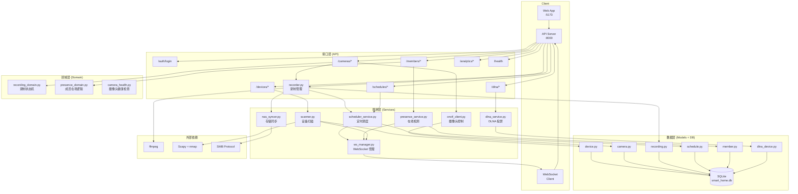

# 智能家居后端

[](https://docs.python.org/3.11/)
[](https://fastapi.tiangolo.com/)
[](https://github.com/nicholaschris/aiosqlite)
[](LICENSE)

基于 FastAPI + SQLite + APScheduler 的智能家居管理后端，支持摄像头管理、录制调度、NAS 同步、设备扫描、DLNA 投屏和家庭成员在线检测。

---

## 架构图



---

## 功能概览

| 模块 | 说明 |
|------|------|
| **设备管理** | 局域网设备扫描（Scapy + nmap），在线状态跟踪，分页查询，支持 14 种设备类型自动识别 |
| **摄像头管理** | ONVIF 发现与配置，实时流地址（RTSP/HTTP），MJPEG 代理，摄像头健康检查 |
| **录制调度** | ffmpeg 分段录制，APScheduler 定时任务，录制预设（preset），自动录制触发（成员到家/离家） |
| **NAS 同步** | 本地存储 / Docker 挂载 / SMB 三种模式，录制完成后自动同步，支持 SMB 协议推送 |
| **DLNA 投屏** | SSDP 发现局域网 MediaRenderer，媒体文件上传，推送播放，控制播放/暂停 |
| **成员在线检测** | 绑定成员与设备 MAC，轮询检测在线状态，Webhook 通知，记录出入日志 |
| **WebSocket** | 实时事件推送（扫描结果、录制状态、DLNA 发现、成员在线变化） |
| **数据分析** | 设备在线统计、录制日历、热力图、设备稳定性、新设备发现等 |
| **认证** | JWT Bearer Token，单管理员账户，支持登录状态保持 |

---

## 技术栈

| 分类 | 技术 |
|------|------|
| **框架** | FastAPI 0.136 + Uvicorn |
| **数据库** | SQLite (aiosqlite + SQLAlchemy 异步) |
| **定时任务** | APScheduler 3.10 |
| **设备扫描** | Scapy 2.7 + python-nmap |
| **摄像头** | ONVIF (onvif-zeep-async) |
| **录制** | ffmpeg (subprocess 调用) |
| **认证** | python-jose (JWT) + passlib |
| **网络** | httpx (异步 HTTP 客户端) |
| **日志** | loguru |
| **配置** | pydantic-settings |
| **代码质量** | pytest, ruff, mypy |

---

## 环境要求

- Python 3.11+
- [uv](https://docs.astral.sh/uv/) 包管理器
- ffmpeg（录制功能必需，需加入 PATH）
- libpcap（Windows 需安装 WinPcap/Npcap，扫描功能必需）

---

## 快速启动

### 1. 安装依赖

```bash
uv sync
```

### 2. 配置环境变量

```bash
cp .env.example .env
```

编辑 `.env`，至少修改以下字段：

**必填：**

| 变量 | 默认值 | 说明 |
|------|--------|------|
| `JWT_SECRET_KEY` | — | 随机字符串，至少 32 位 |
| `ADMIN_USERNAME` | `admin` | 管理员用户名 |
| `ADMIN_PASSWORD` | — | 管理员密码，至少 8 位 |
| `CAMERA_ONVIF_PASSWORD` | — | 摄像头 ONVIF 密码 |
| `NETWORK_RANGE` | `auto` | 要扫描的网段，如 `192.168.1.0/24`；`auto` 自动推断 |

**录制（可选）：**

| 变量 | 默认值 | 说明 |
|------|--------|------|
| `RECORDING_TEMP_DIR` | `/tmp/recordings` | ffmpeg 临时输出目录 |
| `RECORDING_SEGMENT_SECONDS` | `1800` | 单段录制时长（秒），默认 30 分钟 |
| `RECORDING_RETENTION_DAYS` | `30` | 录制文件保留天数 |

**NAS 存储（可选）：**

| 变量 | 默认值 | 说明 |
|------|--------|------|
| `NAS_MODE` | `local` | `local`（本地）/ `mount`（Docker 挂载）/ `smb`（网络推送） |
| `LOCAL_STORAGE_PATH` | `./data/recordings` | local 模式：本地保存路径 |
| `NAS_MOUNT_PATH` | `/nas/cameras` | mount 模式：容器内挂载路径 |
| `NAS_SMB_HOST` | — | smb 模式：NAS IP |
| `NAS_SMB_SHARE` | — | smb 模式：共享文件夹名 |
| `NAS_SMB_USER` | — | smb 用户名 |
| `NAS_SMB_PASSWORD` | — | smb 密码 |

**其他（可选）：**

| 变量 | 默认值 | 说明 |
|------|--------|------|
| `CORS_ALLOW_ORIGINS` | `http://localhost:5173` | 允许的跨域来源，多个用逗号分隔 |
| `SCAN_INTERVAL_SECONDS` | `60` | 设备自动扫描间隔（秒） |
| `PRESENCE_POLL_INTERVAL_SECONDS` | `30` | 成员在线检测轮询间隔（秒） |
| `LOG_LEVEL` | `INFO` | 日志级别 |

### 3. 启动服务

**生产模式：**
```bash
uv run uvicorn app.main:app --host 0.0.0.0 --port 8000
```

**开发模式（热重载）：**
```bash
uv run uvicorn app.main:app --host 0.0.0.0 --port 8000 --reload
```

**使用 dev 脚本：**
```bash
uv run dev
```

服务启动后访问：
- API 文档：http://localhost:8000/api/docs
- 健康检查：http://localhost:8000/api/v1/health
- 登录接口：`POST /api/v1/auth/login`（form-data: username / password）

### 4. 获取 JWT Token

```bash
curl -X POST http://localhost:8000/api/v1/auth/login \
  -d "username=admin&password=your_password"
```

后续请求在 Header 中携带：`Authorization: Bearer <token>`

### 5. WebSocket 连接

```
ws://localhost:8000/api/v1/ws?token=<jwt_token>
```

服务端主动推送的事件类型：

| 事件 | 说明 |
|------|------|
| `scan_completed` | 设备扫描完成 |
| `recording_completed` | 录制完成 |
| `recording_failed` | 录制失败 |
| `dlna_discover_started` | DLNA 设备发现开始 |
| `dlna_discover_completed` | DLNA 设备发现完成 |
| `presence_changed` | 成员在线状态变化 |

---

## 项目结构

```
smart_home/backend/
├── app/
│   ├── main.py              # FastAPI 应用入口 & lifespan 管理
│   ├── config.py            # 环境变量配置（pydantic-settings）
│   ├── database.py          # SQLAlchemy 异步引擎 & 初始化
│   ├── auth.py              # JWT 签发与校验
│   ├── deps.py              # FastAPI 依赖注入（get_db, get_current_user）
│   ├── desktop.py           # 桌面端打包入口
│   ├── frontend -> /...     # 前端代码软链接
│   │
│   ├── api/                 # API 路由层
│   │   ├── system.py        # 健康检查 & 认证
│   │   ├── devices.py       # 设备管理 & 扫描
│   │   ├── cameras.py       # 摄像头管理 & MJPEG 流
│   │   ├── recordings.py   # 录制记录 & 流媒体
│   │   ├── schedules.py    # 录制调度
│   │   ├── members.py       # 家庭成员 & 在线检测
│   │   ├── dlna.py          # DLNA 发现 & 投屏
│   │   ├── analytics.py     # 数据分析与统计
│   │   ├── user.py          # 用户设置
│   │   └── ws.py            # WebSocket 路由
│   │
│   ├── domain/services/     # 领域服务（核心业务逻辑）
│   │   ├── scanner.py       # 设备扫描（Scapy/nmap）& 设备类型识别
│   │   ├── recorder.py      # ffmpeg 录制任务管理
│   │   ├── onvif_client.py  # ONVIF 摄像头控制
│   │   ├── nas_syncer.py    # NAS/本地存储同步
│   │   ├── scheduler_service.py  # APScheduler 封装
│   │   ├── presence_service.py   # 成员在线检测（MAC 轮询）
│   │   ├── presence_domain.py    # 成员在场领域逻辑
│   │   ├── dlna_service.py  # DLNA/SSDP 控制
│   │   ├── recording_domain.py   # 录制状态机
│   │   ├── camera_health.py # 摄像头健康检查（RTSP探测）
│   │   └── ws_manager.py    # WebSocket 连接管理
│   │
│   ├── models/              # SQLAlchemy ORM 模型
│   │   ├── device.py        # 网络设备（MAC/IP/在线状态/设备类型）
│   │   ├── camera.py        # 摄像头（ONVIF 配置/流地址/预设）
│   │   ├── recording.py     # 录制记录（文件路径/时长/关联调度）
│   │   ├── schedule.py      # 录制调度（cron 表达式/预设/覆盖）
│   │   ├── member.py        # 家庭成员（姓名/MAC/在线状态/Webhook）
│   │   ├── device_online_log.py  # 设备每次扫描的在线日志
│   │   ├── dlna_device.py   # DLNA 设备（UDN/类型/能力）
│   │   └── user_settings.py # 用户设置（键值对）
│   │
│   └── schemas/             # Pydantic 请求/响应 Schema
│       ├── device.py
│       ├── camera.py
│       ├── recording.py
│       ├── schedule.py
│       ├── member.py
│       ├── dlna.py
│       ├── user.py
│       └── __init__.py
│
├── tests/                   # 测试套件（63 个测试）
│   ├── conftest.py          # 全局 fixture（数据库/环境变量）
│   ├── test_api.py          # API 端点集成测试
│   ├── test_analytics.py   # 数据分析 API 测试
│   ├── test_a1_presence_recording.py      # 成员触发自动录制
│   ├── test_a2_unknown_device.py          # 未知设备告警
│   ├── test_a3_camera_health.py           # 摄像头健康检查
│   ├── test_a4_auto_cast.py                # 自动 DLNA 投屏
│   └── test_recording_presets.py          # 录制预设
│
├── data/                    # 数据目录（运行时创建）
│   ├── smart_home.db        # SQLite 数据库
│   └── app.log              # 日志文件
│
├── docs/                    # 文档
│   └── superpowers/         # 设计文档和实现计划
│
├── tools/                   # 外部工具（打包用）
│   ├── ffmpeg/              # ffmpeg.exe
│   └── nmap/                # nmap.exe
│
├── .env.example             # 环境变量示例
├── pyproject.toml           # 项目配置（依赖/工具/包结构）
├── Dockerfile              # Docker 镜像构建
└── smart-home.spec         # PyInstaller 打包配置
```

---

## API 概览

### 认证

| 方法 | 路径 | 说明 |
|------|------|------|
| POST | `/api/v1/auth/login` | 登录获取 JWT Token |

### 设备

| 方法 | 路径 | 说明 |
|------|------|------|
| GET | `/api/v1/devices` | 分页查询设备列表 |
| POST | `/api/v1/devices/scan` | 触发设备扫描 |
| GET | `/api/v1/devices/stats` | 设备在线统计 |
| PATCH | `/api/v1/devices/{mac}/alias` | 更新设备别名 |

### 摄像头

| 方法 | 路径 | 说明 |
|------|------|------|
| GET | `/api/v1/cameras` | 查询摄像头列表 |
| POST | `/api/v1/cameras` | 添加摄像头 |
| GET | `/api/v1/cameras/{id}/stream` | 获取实时流地址 |
| POST | `/api/v1/cameras/{id}/mjpeg` | 获取 MJPEG 代理流 |
| GET | `/api/v1/cameras/{id}/health` | 摄像头健康检查 |

### 录制

| 方法 | 路径 | 说明 |
|------|------|------|
| GET | `/api/v1/recordings` | 分页查询录制记录 |
| GET | `/api/v1/recordings/{id}/stream` | 流媒体播放 |
| DELETE | `/api/v1/recordings/{id}` | 删除录制文件 |

### 调度

| 方法 | 路径 | 说明 |
|------|------|------|
| GET | `/api/v1/schedules` | 查询录制调度 |
| POST | `/api/v1/schedules` | 创建录制调度 |
| PATCH | `/api/v1/schedules/{id}` | 更新调度（启用/禁用/修改） |
| DELETE | `/api/v1/schedules/{id}` | 删除调度 |

### 成员

| 方法 | 路径 | 说明 |
|------|------|------|
| GET | `/api/v1/members` | 查询家庭成员 |
| POST | `/api/v1/members` | 添加成员 |
| PATCH | `/api/v1/members/{id}` | 更新成员（MAC/触发配置） |
| GET | `/api/v1/members/presence/logs` | 在线日志 |

### DLNA

| 方法 | 路径 | 说明 |
|------|------|------|
| GET | `/api/v1/dlna/devices` | 查询发现的 DLNA 设备 |
| POST | `/api/v1/dlna/discover` | 触发设备发现 |
| POST | `/api/v1/dlna/upload` | 上传媒体文件 |
| POST | `/api/v1/dlna/{udn}/play` | 推送播放 |

### 数据分析

| 方法 | 路径 | 说明 |
|------|------|------|
| GET | `/api/v1/analytics/device-stats` | 设备在线统计 |
| GET | `/api/v1/analytics/recording-calendar` | 录制日历 |
| GET | `/api/v1/analytics/device-heatmap` | 设备在线热力图 |
| GET | `/api/v1/analytics/new-devices` | 新设备发现 |

### 系统

| 方法 | 路径 | 说明 |
|------|------|------|
| GET | `/api/v1/health` | 健康检查（ffmpeg/db/nas） |
| GET | `/api/v1/health/detailed` | 详细健康状态 |

---

## 开发者指南

### 测试驱动开发（TDD）

本项目强制要求 TDD流程，所有代码变更遵循以下顺序：

1. **先写测试** — 在修改或新增业务代码之前，先在 `tests/` 中编写覆盖目标场景的测试用例
2. **确认测试失败** — 运行新测试，确保测试因缺少功能/Bug未修复而失败（红色阶段）
3. **实现代码** — 编写最小量的代码使测试通过（绿色阶段）
4. **重构** — 在测试保护下优化代码结构
5. **全量回归** — 运行 `uv run pytest tests/ -v` 确保全部测试通过

### 测试命令

```bash
# 运行所有测试
uv run pytest tests/ -v

# 运行指定测试文件
uv run pytest tests/test_api.py -v

# 运行带覆盖率
uv run pytest tests/ -v --cov=app

# 只收集测试，不执行
uv run pytest tests/ -v --collect-only
```

### 代码规范

```bash
# 检查代码规范
uv run ruff check app/

# 自动修复
uv run ruff check app/ --fix

# 类型检查
uv run mypy app/
```

### 预提交检查

```bash
# 安装 pre-commit hooks
uv run pre-commit install

# 手动触发
uv run pre-commit run --all-files
```

---

## Docker 部署

```bash
# 构建镜像
docker build -t smart-home-backend .

# 运行容器
docker run -d \
  --name smart-home-backend \
  -p 8000:8000 \
  -v $(pwd)/.env:/app/.env \
  -v $(pwd)/data:/app/data \
  smart-home-backend
```

---

## 注意事项

- **ffmpeg**：录制功能依赖 ffmpeg，需单独安装并加入 PATH。健康检查接口会显示 `ffmpeg: false` 表示未安装。
- **Scapy / nmap**：设备扫描在 Windows 上需要 WinPcap 或 Npcap（libpcap）；启动时若出现 `No libpcap provider available` 警告，扫描功能将降级。
- **NAS**：未配置 NAS 时默认使用 `local` 模式，健康检查中 `nas_writable: false` 仅在写入测试失败时出现，不影响其他功能。
- **DLNA 媒体文件**：上传的媒体文件保存在 `data/dlna_media/`，TTL 为 1 小时，最大 500 MB；支持格式：`.mp4 .mkv .avi .mov .ts .mp3 .m4a .flac .wav .m3u8`。
- **成员 Webhook**：Webhook URL 必须使用 `https`，且不能指向内网 IP 地址。

---

## 打包所需外部工具

使用 PyInstaller 打包 Windows exe 前，需在项目根目录放置以下工具：

```
tools/
├── ffmpeg/          # 从 https://ffmpeg.org/download.html 下载 Windows 版本
│   └── ffmpeg.exe   # 放入此目录
└── nmap/            # 从 https://nmap.org/download.html 下载 Windows 版本
    └── (nmap 文件)
```

> 注意：`tools/` 目录已加入 `.gitignore`，不会同步到仓库。若需打包，请手动下载上述工具放置于此目录。

---

## 更新日志

### v0.1.1 (2026-05-22)

**重构**
- 拆分 `Scanner.guess_device_type` 巨型方法为 `_detect_by_ports`、`_detect_by_hostname`、`_detect_by_vendor` 三个私有方法，设备类型检测逻辑更清晰
- 增加设备类型识别关键词常量，消除重复字符串字面量

**代码质量**
- 代码异味扫描修复：移除重复代码、统一错误处理、消除硬编码魔法数字

### v0.1.0 (2026-04-28)

**新增功能**
- 录制预设（RecordingPreset）：支持为每个摄像头配置不同的录制参数（分辨率/码率/帧率）
- 自动继续录制：成员到家/离家触发自动录制开始/停止
- 设备搜索别名：支持按别名搜索设备

**系统改进**
- 懒加载数据库连接，减少启动时间
- CI 工作流优化，pre-push 脚本改进
- 添加 `backend` 包结构，支持 `uv run dev` 启动开发服务器

### v0.0.9 (2026-04-16)

**新增功能**
- 摄像头健康检查：`GET /cameras/{id}/health` 返回 RTSP 连通性探测结果
- 自动 DLNA 投屏：摄像头支持配置 `auto_cast_dlna`，录制完成后自动推流

### v0.0.8 (2026-04-08)

**新增功能**
- DLNA 媒体文件上传与播放控制
- WebSocket 事件：`dlna_discover_started`、`dlna_discover_completed`

### v0.0.7 (2026-03-25)

**新增功能**
- 设备在线日志：每次扫描记录设备在线/离线历史
- 成员在线检测：MAC 轮询 + Webhook 通知 + 出入日志

### v0.0.6 (2026-03-10)

**新增功能**
- NAS 同步：local / mount / smb 三种模式
- 录制保留策略：按天数自动清理

### 更早版本

详见 [git log](https://github.com/your-repo/smart-home-backend/commits/master)