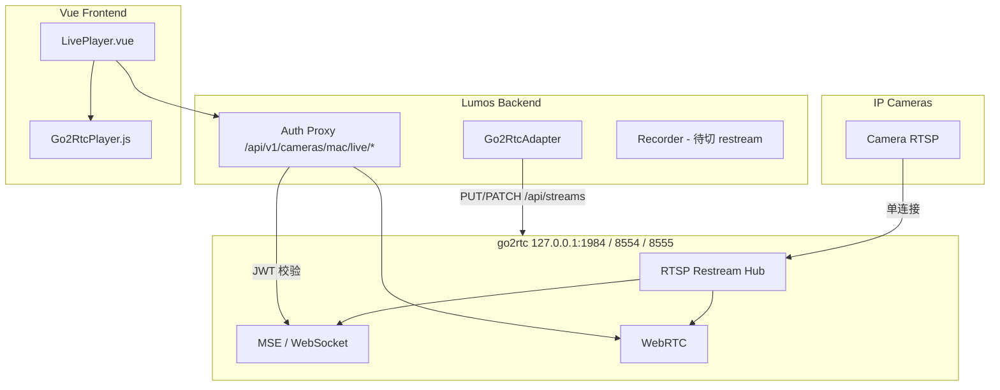

# go2rtc 低延迟直播重构 — 规划与进度

> **文档用途**：直播模块从 HLS 迁移到 go2rtc（Frigate 同款思路）的整体规划、已拍板决策、实现进度与后续任务。  
> **关联文档**：[frigate_borrowing_execution_plan.md](./frigate_borrowing_execution_plan.md)（更广义的 Frigate 借鉴路线图，本专项对应其中 **P0-1 视频管线** 的直播部分）。  
> **最后更新**：2026-06-10

---

## 1. 背景与问题

### 原状（重构前）

| 能力 | 实现 | 问题 |
|------|------|------|
| **实时预览** | `GET /stream/mjpeg`，每浏览器 tab 独立 ffmpeg | 延迟 1–3s，CPU/带宽高，多 tab 多进程 |
| **HLS 直播** | `POST /live/start` → ffmpeg 写 `data/hls/` → video.js | 结构性延迟 5–15s；且前端 bug：`openHlsLive` 启动 HLS 后端却用 MJPEG URL 喂 video.js |
| **录制** | 直连摄像头 RTSP（Frigate 风格 segment muxer） | 与预览/HLS 叠加时 RTSP 连接数膨胀 |

### 目标（参考 [Frigate Live View](https://docs.frigate.video/configuration/live/)）

- 以 **[go2rtc](https://github.com/AlexxIT/go2rtc)** 为可选视频后端：RTSP restream 中枢 + 浏览器低延迟播放。
- 播放优先级：**MSE**（默认）→ **WebRTC**（降级）→ **MJPEG**（兜底 / 低带宽）。
- **废弃 HLS 实时直播**；HLS 若仍需要，仅用于录像回放场景（与 live 分离）。
- **不自研 WebRTC/RTSP server**；Windows 安装包 **内置 go2rtc.exe**。

---

## 2. 已拍板决策（2026-06-10）

| # | 决策 |
|---|------|
| 1 | **同意废弃 HLS live** |
| 2 | **Windows 安装包内置 go2rtc**（`installer/redist/go2rtc/go2rtc.exe`） |
| 3 | Phase 0 UI 止血 **已完成** |
| 4 | 播放器 **模仿 Frigate / go2rtc web-player**（MSE → WebRTC → MJPEG 降级链 + 模式标签） |
| 5 | 开发流程 **强制 TDD**（先写测试，再实现，最后全量回归） |

---

## 3. 目标架构



**鉴权原则**：go2rtc 默认对 localhost 无鉴权；Lumos 在 FastAPI 层校验 JWT（Bearer 或 `?token=`），再代理到本机 go2rtc。

---

## 4. 分阶段规划与进度

| 阶段 | 内容 | 状态 |
|------|------|------|
| **Phase 0** | UI 止血：移除 HLS 入口、废弃 live API、删 video.js live 依赖 | ✅ 已完成 |
| **Phase 1 (M1)** | 后端：`Go2RtcAdapter`、runner、live API、WebSocket/WebRTC 代理 | ✅ 已完成 |
| **Phase 2 (M2)** | 前端：`LivePlayer` + `Go2RtcPlayer` + `getLiveInfo` | ✅ 已完成 |
| **Phase 3 (M3)** | 录制切 go2rtc restream（`rtsp://127.0.0.1:8554/{MAC}`） | ✅ 已完成 |
| **Phase 4 (M4)** | 清理遗留：`StreamManager.start_hls`、HLS 静态路由、旧测试 | ✅ 已完成 |
| **Phase 5 (M5)** | 安装包：复制 `go2rtc.exe`、`installer.iss`、Docker sidecar（可选） | ✅ 已完成 |
| **Phase 6 (M6)** | 摄像头 CRUD 同步 stream；设置页 go2rtc 状态；Frigate 原生直播代理（可选） | ✅ 已完成（Frigate live 代理为可选遗留） |

---

## 5. Phase 0 已完成明细

### 前端

- 移除「HLS 直播」菜单与 `hlsDialog` / `openHlsLive` 全套逻辑。
- `/cameras` 仅保留「实时预览」入口。
- `CameraPlayer.vue` 简化为 `recorded` 模式（录像回放仍用原生 `<video>`）。
- 删除 `startLive` / `stopLive` API 客户端；移除 `video.js` 依赖。
- 删除 vite `/hls` 代理。

### 后端

- `POST/DELETE /cameras/{mac}/live/start|stop` → **410 Gone**（提示将改用 go2rtc）。
- 删除 `/hls/{path}` 静态文件服务。
- `StreamManager` 保留框架，但不再配置 `hls_base`。

### 测试

- `tests/integration/api/test_hls_lifecycle.py` 改为验证 410。

---

## 6. Phase 1 (M1) 已完成明细

### 新增模块

| 文件 | 职责 |
|------|------|
| `backend/app/domain/services/go2rtc_adapter.py` | 同步 stream、构建 live URL、ping、WebRTC POST |
| `backend/app/domain/services/go2rtc_runner.py` | 内置二进制启停、`go2rtc.yaml` 生成 |
| `backend/app/domain/services/go2rtc_proxy.py` | WebSocket 双向代理 |

### API（`backend/app/api/cameras.py`）

| 方法 | 路径 | 说明 |
|------|------|------|
| `GET` | `/api/v1/cameras/{mac}/live` | 返回 `LiveStreamOut`；启用 go2rtc 时 `ensure_stream` |
| `WS` | `/api/v1/cameras/{mac}/live/ws?token=` | MSE 流代理 |
| `POST` | `/api/v1/cameras/{mac}/live/webrtc?token=` | WebRTC SDP 代理 |
| `GET` | `/api/v1/cameras/{mac}/stream/mjpeg?token=` | MJPEG 兜底（保留） |
| `POST/DELETE` | `/api/v1/cameras/{mac}/live/start\|stop` | 已废弃，410 |

### Schema

- `backend/app/schemas/camera.py` → `LiveStreamOut`（`mode`, `stream_name`, `status`, `mse_ws_url`, `webrtc_url`, `mjpeg_url`）

### 配置（`backend/app/config.py` / `.env`）

```env
GO2RTC_ENABLED=false          # 开发默认关；打包模式检测到二进制可自动开
GO2RTC_API_URL=http://127.0.0.1:1984
GO2RTC_RTSP_URL=rtsp://127.0.0.1:8554
GO2RTC_CONFIG_PATH=./data/go2rtc.yaml
GO2RTC_BINARY=                # 可选，显式指定 go2rtc 路径
```

### 启动（`backend/app/main.py`）

- 创建 `Go2RtcAdapter` + `httpx.AsyncClient`。
- lifespan：若启用且找到二进制 → `Go2RtcRunner.start()`；shutdown 时 stop + aclose。
- 打包模式 PATH 追加 `{exe_dir}/go2rtc`。
- `app.state.go2rtc_adapter` 在 app 创建时即挂载（便于测试不跑 lifespan）。

### Stream 命名

- MAC `AA:BB:CC:DD:EE:01` → go2rtc stream 名 `AA-BB-CC-DD-EE-01`（`mac_to_stream_name`）。

### 测试

- `backend/tests/unit/domain/test_go2rtc_adapter.py`
- `backend/tests/unit/domain/test_go2rtc_runner.py`
- `backend/tests/integration/api/test_camera_live.py`
- `backend/tests/conftest.py` 设置 `GO2RTC_ENABLED=false`

---

## 7. Phase 2 (M2) 已完成明细

### 新增/修改

| 文件 | 职责 |
|------|------|
| `frontend/src/api/cameras.js` | `getLiveInfo(mac)` |
| `frontend/src/utils/livePlayer.js` | `pickLiveMode`, `withStreamToken`, `wsUrlFromApiPath` |
| `frontend/src/lib/Go2RtcPlayer.js` | 精简 go2rtc 协议客户端（MSE → WebRTC），参考 [go2rtc video-rtc.js](https://github.com/AlexxIT/go2rtc/blob/master/www/video-rtc.js) |
| `frontend/src/components/LivePlayer.vue` | 调 `getLiveInfo`，显示模式徽章，降级 MJPEG |
| `frontend/src/views/CameraView.vue` | 实时预览改用 `<LivePlayer :mac="..." />` |
| `frontend/src/composables/useCameraActions.js` | `liveMac` 替代 `liveUrl` |
| `frontend/vite.config.js` | `/api` 代理开启 `ws: true` |

### 播放流程

1. 用户点「实时预览」→ `openLive(cam)` → 打开 dialog。
2. `LivePlayer` mount → `GET /cameras/{mac}/live`。
3. `mode === 'mse'` 且有 `mse_ws_url` → `Go2RtcPlayer` 连 WebSocket 代理。
4. 否则 / 失败 → `` 拉 MJPEG（带 token）。
5. 左上角显示模式标签（`MSE` / `WebRTC` / `MJPEG`）。

### 测试

- `frontend/tests/utils/livePlayer.test.js`
- `frontend/tests/components/LivePlayer.test.js`
- `frontend/tests/api/cameras.test.js`（`getLiveInfo`）

### 说明

- 未直接 vendoring 完整 `video-rtc.js`（体积与许可考量）；自研 `Go2RtcPlayer.js` 对齐 go2rtc WebSocket 协议，后续可按需替换为官方脚本。

---

## 8. Phase 6 (M6) 已完成明细

### 后端 — CRUD 同步 stream

| 触发点 | 行为 |
|--------|------|
| `POST /cameras` | 有 `rtsp_url` → `ensure_stream` |
| `PUT /cameras/{mac}` | 更新 `rtsp_url` / ONVIF 凭据 → `ensure_stream` |
| `DELETE /cameras/{mac}` | `remove_stream` |
| `POST /cameras/{mac}/probe` | 自动写入 `rtsp_url` → `ensure_stream` |

go2rtc 未启用（`adapter.config.enabled=false`）时全部跳过。

### 后端 — 设置 API

| 方法 | 路径 | 说明 |
|------|------|------|
| `GET` | `/api/v1/go2rtc` | 状态：enabled、connected（ping）、runner、URLs、candidates |
| `PUT` | `/api/v1/go2rtc` | 运行时启用/禁用；写入 `webrtc.candidates` 到 `go2rtc.yaml` |

Schema：`backend/app/schemas/go2rtc_settings.py`（`Go2RtcStatusOut`、`Go2RtcSettingsUpdate`）。

### 前端

| 文件 | 职责 |
|------|------|
| `src/api/system.js` | `getGo2RtcStatus`、`updateGo2RtcSettings` |
| `src/components/settings/SettingsGo2RtcPanel.vue` | 设置页 go2rtc 面板 |
| `src/views/SettingsView.vue` | 系统区块挂载面板，刷新与健康检查联动 |
| `src/components/cameras/CameraTable.vue` | 操作列「实时预览」文字按钮 |

### 测试

- `backend/tests/integration/api/test_go2rtc_settings.py`
- `backend/tests/integration/api/test_camera_go2rtc_sync.py`
- `frontend/tests/api/system.test.js`
- `frontend/tests/components/SettingsGo2RtcPanel.test.js`
- `frontend/tests/components/CameraTable.test.js`

### 说明

- 设置页 **开启 + 不可达** = go2rtc 进程未运行，属正常；预览降级 MJPEG。
- 运行时开关不写入 `.env`，重启后仍以 `GO2RTC_ENABLED` 为准。

---

## 9. 待办归档（M3–M6 均已完成，仅留手动验收）

### M3 — 录制切 restream（高优先级）✅

- [x] `Recorder._resolve_recording_rtsp_url()`：go2rtc 启用时 `ensure_stream` + `restream_url`，否则直连摄像头 RTSP。
- [x] `Recorder.__init__` 注入 `go2rtc_adapter`；`main.py` 在创建 adapter 后传入 recorder。
- [x] TDD：`tests/unit/domain/test_recorder.py` — `TestResolveRecordingRtspUrl` + `test_start_recording_uses_restream_url_when_go2rtc_enabled`。
- [ ] 验收：预览 + 录制同时进行时，摄像头 RTSP 连接数 = 1（需本地启用 go2rtc 手动验证）。

### M4 — 清理 HLS 遗留 ✅

- [x] 删除 `StreamManager.start_hls()`、`_build_hls_cmd`、`hls_dir_for`、`hls_base`。
- [x] 删除 `test_stream_manager.py` 中 HLS 相关用例（保留通用 start/stop 测试）。
- [x] 录像回放路径未改动（live HLS 已在 Phase 0 移除）。

### M5 — 安装包内置 go2rtc ✅

- [x] `installer/fetch-go2rtc.ps1` 下载 [go2rtc_win64.zip](https://github.com/AlexxIT/go2rtc/releases) → `installer/redist/go2rtc/go2rtc.exe`（不提交 git）。
- [x] `installer/installer.iss` 复制 go2rtc 目录；`build.ps1` Step 0 校验 redist 完整性。
- [x] 打包：`main.py` PATH 含 `{exe_dir}/go2rtc`；`resolve_go2rtc_binary` + `should_start_embedded_runner` 测试。
- [x] Docker Compose：`go2rtc` sidecar（`alexxit/go2rtc`，`network_mode: host`）+ `GO2RTC_ENABLED=true` 外部模式（不降级 MJPEG）。

### M6 — 完善集成 ✅

- [x] 摄像头 create/update/delete 时自动 `ensure_stream` / `remove_stream`（`test_camera_go2rtc_sync.py`）。
- [x] ONVIF 探测自动写入 `rtsp_url` 时同步 stream。
- [x] 设置页：`GET/PUT /api/v1/go2rtc` + `SettingsGo2RtcPanel`（连接状态、启用/禁用、candidates 编辑）。
- [x] 摄像头表「实时预览」改为文字按钮（`CameraTable.vue` + `CameraTable.test.js`）。
- [x] 更新 `backend/README.md` API 表与环境变量（HLS live → go2rtc live）。
- [ ] （可选，专项外）已配置 `frigate_name` 时走 Frigate 原生 live API。

---

## 10. 验证命令

```bash
# 后端 — go2rtc 专项
cd backend && uv sync
uv run pytest tests/unit/domain/test_go2rtc_adapter.py \
  tests/unit/domain/test_go2rtc_runner.py \
  tests/unit/domain/test_recorder.py::TestResolveRecordingRtspUrl \
  tests/unit/services/test_stream_manager.py \
  tests/integration/api/test_camera_live.py \
  tests/integration/api/test_camera_go2rtc_sync.py \
  tests/integration/api/test_go2rtc_settings.py \
  tests/integration/api/test_hls_lifecycle.py -v

# 后端 — 全量回归
uv run pytest tests/ -v

# 前端
cd frontend && pnpm install && pnpm test tests/api/system.test.js \
  tests/api/cameras.test.js \
  tests/components/LivePlayer.test.js \
  tests/components/SettingsGo2RtcPanel.test.js \
  tests/components/CameraTable.test.js \
  tests/utils/livePlayer.test.js
```

### 本地启用 go2rtc 开发

1. 安装或下载 go2rtc，监听 `127.0.0.1:1984`。
2. `backend/.env` 设置 `GO2RTC_ENABLED=true`。
3. 后端 `:8000` + 前端 `:5173`（Vite 代理含 WebSocket）。

未启用 go2rtc 时：行为与 Phase 0 一致，live 降级为 MJPEG。

---

## 11. 关键文件索引

```
backend/
  app/config.py                          # GO2RTC_* 配置
  app/main.py                            # lifespan 启停 go2rtc
  app/deps.py                            # Go2RtcDep, StreamUser + Query token
  app/api/cameras.py                     # live / ws / webrtc / mjpeg
  app/schemas/camera.py                  # LiveStreamOut
  app/domain/services/go2rtc_adapter.py
  app/domain/services/go2rtc_runner.py
  app/domain/services/go2rtc_proxy.py
  app/api/system.py                      # GET/PUT /go2rtc
  app/schemas/go2rtc_settings.py
  app/domain/services/recorder.py        # M3 restream
  app/domain/services/stream_manager.py  # 通用进程框架（HLS 已移除）
  tests/unit/domain/test_go2rtc_*.py
  tests/integration/api/test_camera_live.py
  tests/integration/api/test_camera_go2rtc_sync.py
  tests/integration/api/test_go2rtc_settings.py
  tests/integration/api/test_hls_lifecycle.py

frontend/
  src/api/cameras.js                     # getLiveInfo, mjpegStreamUrl
  src/api/system.js                      # getGo2RtcStatus, updateGo2RtcSettings
  src/components/LivePlayer.vue
  src/components/settings/SettingsGo2RtcPanel.vue
  src/components/cameras/CameraTable.vue # 实时预览入口
  src/lib/Go2RtcPlayer.js
  src/utils/livePlayer.js
  src/views/CameraView.vue
  src/views/SettingsView.vue
  tests/components/LivePlayer.test.js
  tests/components/SettingsGo2RtcPanel.test.js
  tests/components/CameraTable.test.js
  tests/utils/livePlayer.test.js

installer/
  build.ps1                              # Step 0 校验 redist（含 go2rtc）
  fetch-go2rtc.ps1                       # 下载 go2rtc.exe 到 redist/go2rtc/
```

---

## 12. 风险与开放问题

| 项 | 说明 |
|----|------|
| H.265 摄像头 | 浏览器 MSE/WebRTC 需 H.264；go2rtc 需 `ffmpeg:` 转码分支（Adapter 待扩展） |
| WebRTC 广域网 | 设置页可编辑 `webrtc.candidates`；广域网仍需正确 STUN/公网 IP |
| HTTPS / WebRTC | 本地 dev 用 HTTP 即可；生产若纯 HTTP 则 WebRTC 仅 LAN 增强 |
| 手动验收 | 预览+录制同时进行时 RTSP 连接数 = 1（需本机起 go2rtc） |
| MJPEG/snapshot | 仍直连摄像头 RTSP；与 go2rtc restream 录制/live 并存 |

---

## 13. 与 Frigate 借鉴计划的对照

| frigate_borrowing_execution_plan.md 任务 | 本专项状态 |
|------------------------------------------|------------|
| 抽象 StreamManager | ✅ 已有（HLS live 已移除） |
| HLS 进程下沉服务层 | ✅ 已废弃 HLS live |
| 调研 go2rtc 三种部署模式 | ✅ 设计为 embedded / external / docker |
| go2rtc 适配层 | ✅ Go2RtcAdapter |
| 单摄像头预览+录制连接数受控 | ✅ M3 restream（代码已切，待本地验收） |
| Frigate Bridge MQTT | ✅ 独立已完成，与本专项正交 |

---

## 14. 专项收尾状态与后续可选

**go2rtc 直播重构（M0–M6）代码侧已收尾。**

建议本地一次性验收：

1. 跑通 **§10 验证命令**（pytest + pnpm test）。
2. 下载并启动 go2rtc → 设置页 API **可连接** → 摄像头 **实时预览** 显示 MSE/MJPEG 徽章。
3. （可选）同时预览+录制，确认摄像头 RTSP 连接数受控。
4. （可选）`pwsh installer/fetch-redist.ps1` 打安装包（打包可另开专项）。

**后续可选（不在本专项范围）：**

- Frigate 原生 live API（`frigate_name` 已配置时）
- go2rtc `ffmpeg:` 转码分支（H.265 摄像头）
- 设置页运行时开关持久化到数据库

新会话可将本文档 + 用户拍板决策（§2）作为上下文入口。
